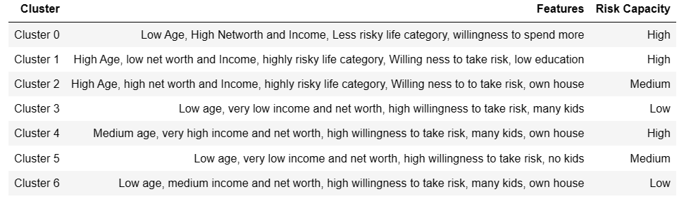
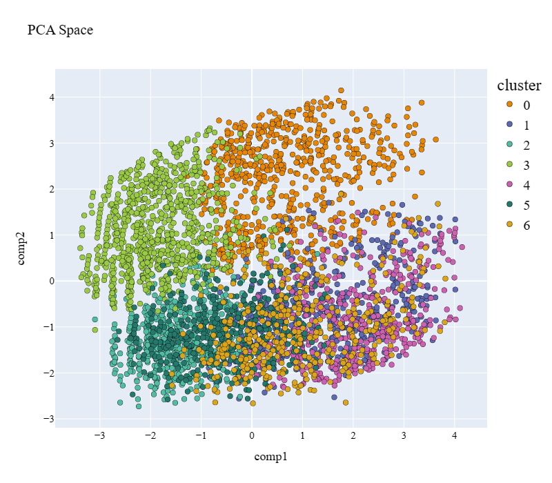
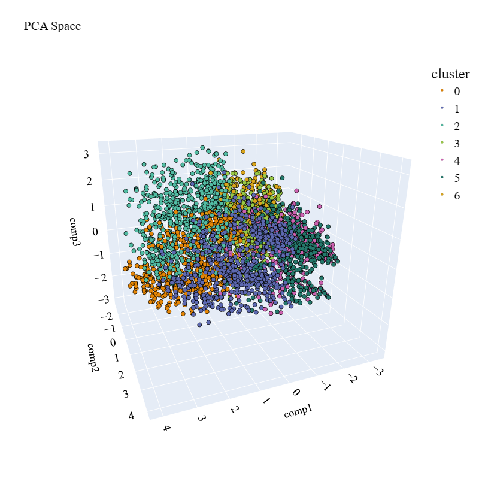
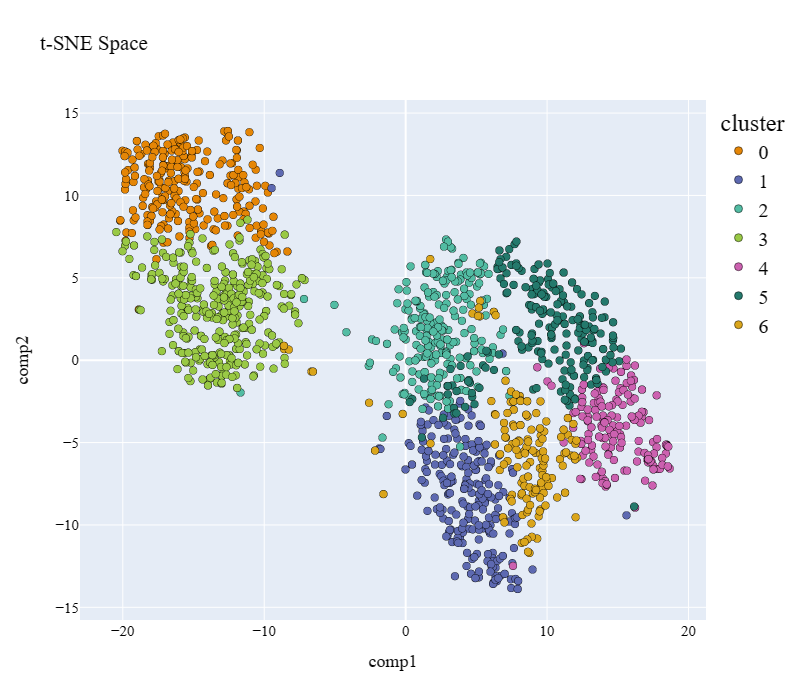
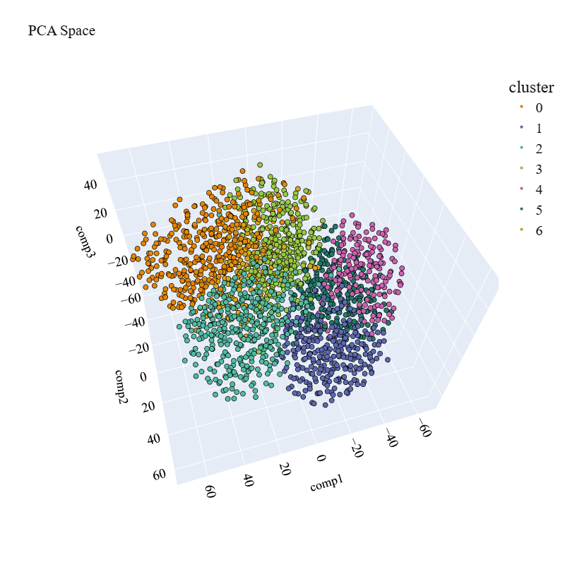

# Customer Segmentation Project

This project explores customer segmentation using clustering algorithms.
Youtube video link : https://youtu.be/TKjutKNKvWs

## Overview

I am talking about the use of clustering algorithms, including **K-Means**,  **Affinity Propagation**, to understand and segment a database in order to identify customers' propensity for risk-taking.
But that's not all. I will guide you through essential methods to determine the optimal number of clusters to use, including the **Elbow Method** and the **Silhouette Score**. 
You will also learn how to choose the best clustering models for your project using the **Silhouette Score**.

Finally, we will explore powerful visualization techniques such as **Principal Component Analysis** (PCA) and **t-SNE** to make segmentation results clear and visually appealing.
 🔍🎯

## Results

Some visualization of clusters through PCA(2D/3D): 

Some visualization of clusters through t-SNE(2D/3D): 

## Video Demo

## Contributing

GUIDJIME ADINSI Ahouahounko
Former Data scientist/Machine Learning Engineer at Abeille Assurances

